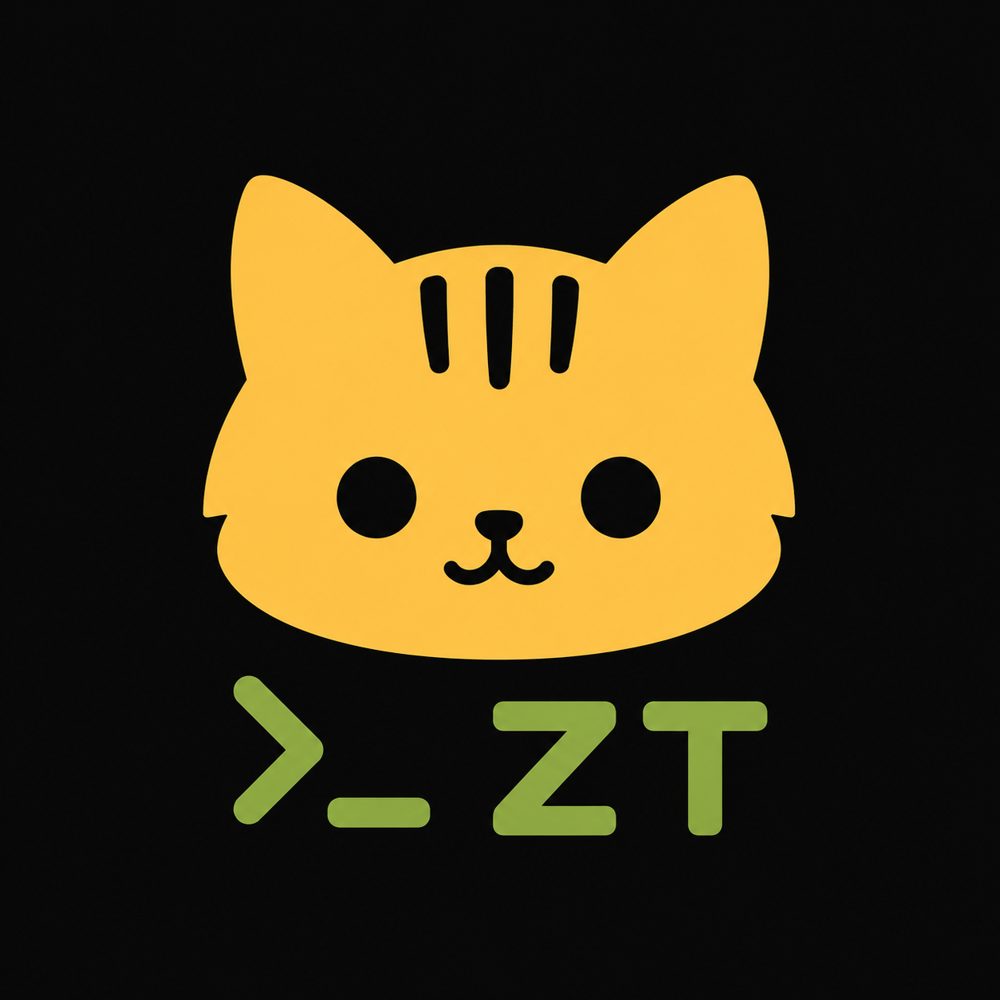

<p align="center">
  
</p>

<h1 align="center">Zzam Tiger</h1>

<p align="center">
  See what your AI agents changed, understand what remains, and take action—without leaving the terminal.
</p>

## Why “Zzam Tiger”?

In Korean, *jjam tiger* (짬타이거) is an affectionate nickname for a cat that lives around a military base and knows exactly where to find leftover food (*jjam*, 짬). It is resourceful, observant, and always nearby.

Zzam Tiger brings that same character to AI-assisted development. It stays close to your terminal, keeps an eye on the work happening in your repository, and helps you quickly find what needs your attention next.

## Why We Built It

Working with AI coding agents creates a new kind of coordination problem. An agent may edit several files, prepare a commit, open or update an issue, review a pull request, or leave work for the next session. The more agents you use, the harder it becomes to answer two simple questions:

1. **What did the AI do?**
2. **What still needs to be done?**

Zzam Tiger was built so those answers are always available inside the terminal. It combines the local Git workspace with the repository activity that lives on GitHub or GitLab, giving you one place to inspect changes, review diffs, manage work, and decide the next instruction for your agents. There is no need to constantly switch between terminal commands and browser tabs just to reconstruct the state of the work.

## Features

- Review staged and unstaged changes, browse files, inspect diffs, and create commits.
- Explore commit history and branch topology in a visual Git graph.
- View and manage GitHub pull requests, GitLab merge requests, issues, milestones, and branches.
- Read descriptions, comments, reviews, inline threads, and CI job logs.
- Comment, review, assign, label, close, reopen, merge, rerun, and cancel directly from the terminal.
- Navigate comfortably with either the keyboard or mouse.
- Use your existing authenticated `gh` or `glab` session—no additional API token configuration.
- Run as a single Go binary on Linux and macOS.

## Installation

### Prerequisites

Zzam Tiger uses the provider detected from the current repository's `origin` remote:

- For GitHub, install [`gh`](https://cli.github.com/) and run `gh auth login`.
- For GitLab, install [`glab`](https://gitlab.com/gitlab-org/cli) and run `glab auth login`.

### Install the Latest Release

```sh
curl -fsSL https://raw.githubusercontent.com/SKAIBlue/zzam-tiger/main/install.sh | sh
```

The installer downloads the correct binary for your operating system and CPU architecture, verifies its SHA-256 checksum, and installs it to `~/.local/bin` by default.

To use a different destination:

```sh
curl -fsSL https://raw.githubusercontent.com/SKAIBlue/zzam-tiger/main/install.sh | INSTALL_DIR=/usr/local/bin sh
```

### Build from Source

Go 1.24 or newer is required.

```sh
go install github.com/SKAIBlue/zzam-tiger/cmd/zt@latest
```

## Usage

Open a cloned GitHub or GitLab repository and run:

```sh
zt
```

Zzam Tiger automatically detects the hosting provider from `origin`. Run `zt --help` to see provider, repository, and refresh overrides.

### Recommended Setup: Split Your Terminal

Zzam Tiger works especially well in a split-terminal layout. Keep your AI coding agent in one pane and run `zt` in another so you can watch changes, review completed work, and identify the next task without interrupting the agent's session.

I use [herdr](https://herdr.dev/), a terminal multiplexer built for working with AI agents. Its panes make it easy to keep your agents and Zzam Tiger visible side by side in the same workspace.

## License

Zzam Tiger is released under the [0BSD License](LICENSE). You may use, copy, modify, and distribute it freely, including for commercial purposes, with no attribution requirement.
